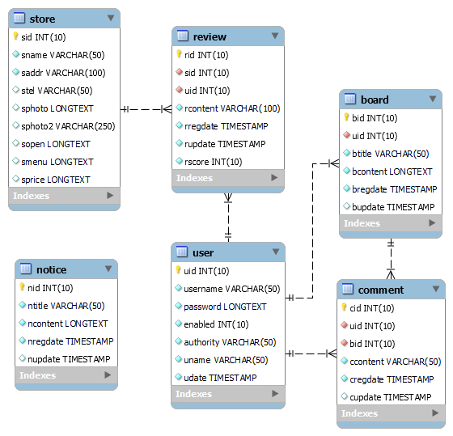

## 1. 소개

디저트 카페의 평점, 리뷰를 찾아보거나 리뷰할 수 있는 웹 애플리케이션입니다.

  

## 2. 기술

- 개발 : Java 8, Spring Framework 5.3, MyBatis 3.5, JSP 2.3, Maven
- 운영 : Cafe24, CentOS 7, Tomcat 8.5, MariaDB 10.0
- 외부 서비스 연동 : Gmail SMTP Server, Kakao Map API
- 스크래핑 : Python
- 깃 브랜치 전략 : GitLab Flow
  - 인원별로 역할 분담을 하여 각자 구현해야 할 기능이 구분되어 있기 때문에 기능별로 브랜치를 나누는 대신에 인원별로 브랜치를 나누었습니다. 브랜치를 합쳐야 할 경우에는 먼저 테스트할 브랜치로 머지하여 그 안에서 테스트 후 문제가 없다면 최종적으로 마스터 브랜치로 머지하는 식으로 진행하였습니다.

  

## 3. DB

  

## 4. 설명

### 사용자

- 사용자는 관리자, 회원, 비회원으로 구분됩니다. 인증과 인가는 Spring Security를 이용해 세션 기반 인증 방식으로 처리했습니다.
- 회원가입을 하기 위해서는 이메일 인증이 필요합니다.
- 회원가입 완료 시에는 가입한 이메일로 웰컴 메일이 발송되도록 하였습니다.
- 비밀번호 찾기는 이메일 인증을 하면 이메일로 임시 비밀번호가 발송되는 방식입니다. 임시 비밀번호 생성은 난수 예측을 방지하기 위해 SecureRandom을 이용했습니다.
- 메일 발송은 Gmail SMTP Server를 이용했습니다.

### 가게

- Python으로 Pandas, BeautifulSoup, Selenium, Requests를 활용해 만든 웹 스크래퍼와 공공데이터포털의 오픈API를 통해 얻은 가게 데이터들을 적절히 가공 후 store 테이블에 추가했습니다.
- 가게 메뉴 첫 화면에서 게시물 표시 개수 조정, 여러 옵션에 대한 검색, 페이징을 동시에 처리할 수 있도록 Mybatis 동적 쿼리를 작성했습니다.
- 가게에 들어가면 가게의 평점과 리뷰를 포함하는 여러 가게 정보들을 볼 수 있습니다. 가게 위치를 표시하기 위해 Kakao Map API를 이용했니다. 가게의 리뷰는 5점 만점인 별점과 함께 간단한 커멘트를 할 수 있습니다. 리뷰를 반복하여 평점을 조작할 가능성이 있기 때문에 한 회원이 한 가게를 리뷰하는 것은 한 번까지만 할 수 있도록 하였습니다.

### 메인 페이지

- 사용자 입장에서 자주 사용할 만한 여러 편리한 기능들을 메인 페이지에 추가했습니다. 각각의 기능들을 구현하기 위한 Mybatis 동적 쿼리를 작성했습니다. 지도 표시는 Kakao Map API를 이용했습니다.
  - 찾고싶은 가게를 검색할 수 있는 검색창
  - 지역별로 가게들을 모아서 볼 수 있는 링크들
  - 유저 자신의 위치와 주변 가게들 위치가 함께 표시되는 지도

### 일반 게시판

- 일반 글 작성, 열람이 목적인 게시판입니다. 자유게시판, 공지사항이 있습니다.
- 편리한 게시글 작성을 위해 Summernote를 이용했습니다.
- 게시물 표시 개수 조정, 여러 옵션에 대한 검색, 페이징을 동시에 처리할 수 있도록 Mybatis 동적 쿼리를 작성했습니다.

### 기타 사항

- 입력 데이터의 유효성 검사를 위해 Bean Validation과 정규 표현식을 이용하였습니다. 필요한 경우 Custom Validator를 만들어 적용하였습니다.
- 예외 처리를 위해 @ExceptionHandler와 @ControllerAdvice를 이용했습니다.
- Spring Security의 CSRF Filter를 이용해 CSRF 공격을 방어할 수 있게 하였습니다. CSRF Filter는 CSRF 토큰을 검증해 위조된 페이지에서 받는 요청은 거르고 실제 페이지에서 전송된 요청만을 처리하게 해줍니다.
